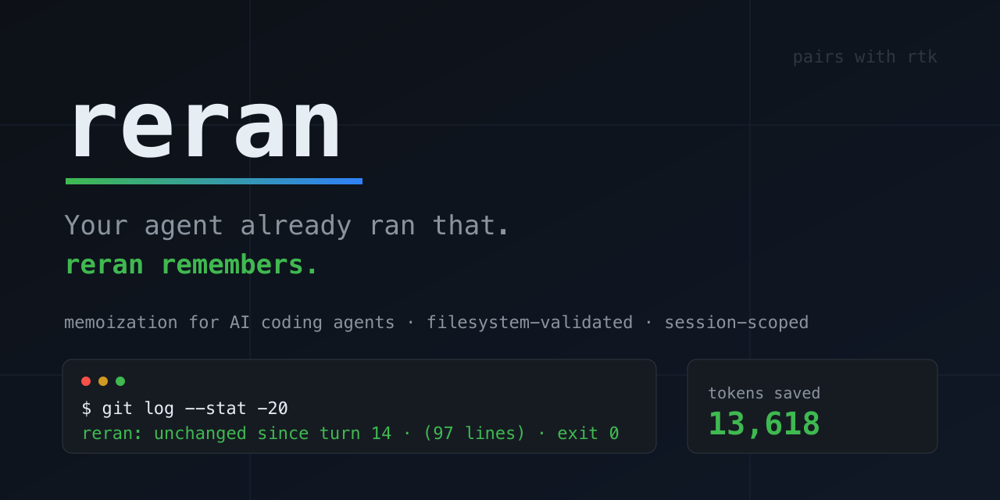

<div align="center">

</div>

<div align="center">

[](LICENSE)
[](https://www.rust-lang.org)
[](#install)
[](#status)

Memoization + output-extraction layer for AI coding agents
(ZCode, Claude Code, OpenCode — any harness with shell hooks).

</div>

The agent's shell call comes in; reran answers either **`unchanged since turn N`**
— exact, filesystem-validated, session-scoped — or a **compact structured
digest**, instead of the raw multi-thousand-token dump.

**rtk compresses the *first* call. reran kills the repeats.** They compose:
rtk squeezes the misses, reran stops the repeats from happening at all.

---

## The problem

An agent session re-runs the same read-only commands a dozen times:

```console
$ git status      # turn 2    ~1,200 tokens
$ git status      # turn 9    ~1,200 tokens
$ git diff        # turn 14   ~2,800 tokens
$ git status      # turn 21   ~1,200 tokens  ← file changed at turn 17? no? same answer.
```

Nothing changed between those calls, yet the agent pays full price every time —
or worse, *trusts its memory* and skips the call. TTL-based caches guess when an
answer expires. reran **knows**: the answer is keyed to the actual bytes on
disk.

## What it looks like

Real output formats — nothing invented for this README:

```jsonc
// PreToolUse (before the command runs) — cache hit:
{
  "hookSpecificOutput": {
    "permissionDecision": "deny",
    "permissionDecisionReason": "reran: unchanged since turn 1 · git status · exit 0"
  }
}
```

```console
# Extraction: 2.9K of pytest noise → one digest line (stored on the hit):
pytest: 43 passed in 1.2s · exit 0

# Same command, later in the session, no files touched:
$ pytest -q
reran: unchanged since turn 1 · pytest: 43 passed in 1.2s · exit 0

# A failure is never cached and never phrased as success:
FAILED (exit 1): pytest: 41 passed, 2 failed in 3.2s; failed: tests/test_b.py::test_x

# Every elision is explicit and machine-countable:
[+312 lines elided by reran]

# And when you want to know why:
$ reran explain -- git status
miss: entry exists but this session never saw its output (runs fresh) · memoizable
```

A miss costs a few tokens. **A lie costs the agent its correctness** — so reran
is built to be unable to lie. See the [trust contract](#trust-contract).

## Measured, not promised

`reran gain` counts saved tokens only on replaced output (bytes/4) — no vanity
math. This is a real report from a live ZCode dogfood session (including
deliberate repeat benchmarks):

```console
$ reran gain
reran Token Savings
════════════════════
Total commands:    241 (hits 10 · misses 30 · bypass 195 · uncached failures 0)
  no exit code 0 · not completed 2 (cancelled/timed out — never cached)
Tokens saved:      13,618 (counted only on replaced output, bytes/4)
Hit rate:          29.0%  ███████░░░░░░░░░░░░░░░░░

By command (top 5 by savings)
─────────────────────────────
  1. ls -la /usr/bin         ×1    7.1K tok
  2. grep -rn fn src tests   ×1    4.1K tok
  3. git log --stat -15      ×1    1.6K tok
  4. git log --oneline -30   ×1    25 tok
  5. whoami                  ×1    0 tok
```

Read the honest version of that table: `whoami` hit and saved **zero** — a hit
on a tiny output saves nothing, because saved = (output − digest) / 4. Savings
come from *big* outputs *repeated* *while the filesystem stands still*. Write-
heavy interactive work (tests, builds, commits) is bypass by design — the one
thing reran will never do is hand the agent yesterday's test result.

## How it works

- **Hook adapter** — `reran init zcode` / `reran init claude-code` wires
  PreToolUse + PostToolUse hooks. PreToolUse answers from cache (deny-with-
  digest: the cached answer *is* the permission reason). PostToolUse records
  the real output. Fail-open: a broken reran never blocks the agent.
- **Invalidation by filesystem state, not TTL.** Cache key =
  `hash(cwd, argv, uid, allowlisted env, fs-content epoch)`. Any file change in
  the project — or any write-classified command — resets every answer. No
  stale-hit window, no "cache TTL: 5s" guessing.
- **Session-scoped `unchanged`.** reran never claims "unchanged" for output the
  current session has not actually received. (25% of cachebro's cached replies
  hid content the agent was never shown. This bug class is designed out.)
- **Extraction grammars** for dynamic output: pytest, cargo test, go test,
  vitest/jest, tsc, curl/JSON → counts, failing test names, exit status. Low
  extraction confidence → raw passthrough.
- **Agent-shaped reads** (v1.2–v1.3): read-only pipelines (`ls X && echo --- &&
  find Y | head`), fd-redirects (`2>&1`, `2>/dev/null`), `sed -n 'Np'`,
  pure-stdout text utilities (jq, diff, stat, xxd, …), `tsc --noEmit`, and
  `cd DIR && <reads>` (when DIR stays inside the scanned subtree) are
  memoizable — the exact composition agents actually run.
- **Opt-in test cache**: `reran allow-tests on` lets a project cache pytest /
  cargo test / npm test outputs. Off by default — tests can be
  nondeterministic; the flag is your explicit acceptance.
- **Rewrite-hook tolerant.** Output-optimizer hooks rewrite commands before
  execution (rtk maps `head -5 F` → `rtk read F --max-lines 5` — a different
  verb). reran pins the argv the agent actually asked for to the payload's
  toolCallId and caches under *that*, so optimizer + memoizer compose with no
  configuration. Works with any rewriter, any shape of rewrite.
- **Honest accounting.** `reran gain` counts tokens saved only on replaced
  output (bytes/4). No vanity math.

## Trust contract

1. **Exit codes are sacred.** Non-zero is never cached, never rendered green.
   Every digest ends with an explicit `exit N`; failures are prefixed
   `FAILED (exit N)`.
2. **Non-completion is not completion.** Cancelled / timed-out / interrupted
   runs are never cached — even when the exit code says 0.
3. **Every elision is explicit** and machine-countable:
   `[+N lines elided by reran]`.
4. **Exact matching only.** No semantic, fuzzy, or "close enough" cache hits —
   ever.

## Install

Not on registries yet (v0.1, pre-release) — build from source:

```console
$ cargo install --git https://github.com/HighlyLoadedEgo/reran
```

Requires a Rust toolchain (edition 2021). Then wire your harness:

```console
$ reran init zcode          # or: reran init claude-code
$ reran gain                # watch savings accumulate
$ reran explain -- <cmd>    # why would this hit / miss / bypass?
$ reran allow-tests on      # per-project: cache test outputs too (opt-in)
```

`init` is idempotent and preserves existing hooks. Removing reran = deleting
two hook lines.

### Troubleshooting

- **Changed `hooks` or `plugins` in the harness config? Restart the whole
  app.** ZCode resolves hooks and plugin registrations at startup only —
  mid-session config edits silently do nothing (verified 2026-10-05: a
  PostToolUse hook stayed dead across every tool call until restart, while
  PreToolUse from the same config block kept firing).
- **A rewrite hook (e.g. rtk-bridge) wraps commands before execution?**
  reran strips the `rtk ` wrapper prefix in both hook directions, so the
  cache key is the original command either way. Bare `rtk` invocations stay
  bypass (unknown command).

## Status

| Milestone | Scope | State |
|-----------|-------|-------|
| M1 | Core engine, SQLite store, hook adapter, `gain` | ✅ shipped |
| M2 | Extraction grammars, hygiene, live-payload probe | ✅ shipped |
| M3 | `explain`, `init zcode`, MCP-proxy (hookless harnesses) | 🔶 partial |
| M4 | npm / brew / cargo publish, reproducible benchmark | ⏳ pending |

84/84 tests green. Caching through ZCode hooks is live and verified end-to-end
against real PostToolUse payloads (`exitCode`, `cancelled`, `timedOut`,
`status` — all honored), including coexistence with the rtk-bridge rewrite
hook, live. Planned next: reproducible session-replay benchmark (M4), MCP
proxy for hookless harnesses (M3).

## Design docs

- Spec: [`docs/specs/2026-10-04-reran-design.md`](docs/specs/2026-10-04-reran-design.md)
- Plan: [`docs/plans/`](docs/plans/)

## Name

`reran` — past tense of re-run; verified free on npm, crates.io, and Homebrew
(2026-10-04).

## License

MIT
